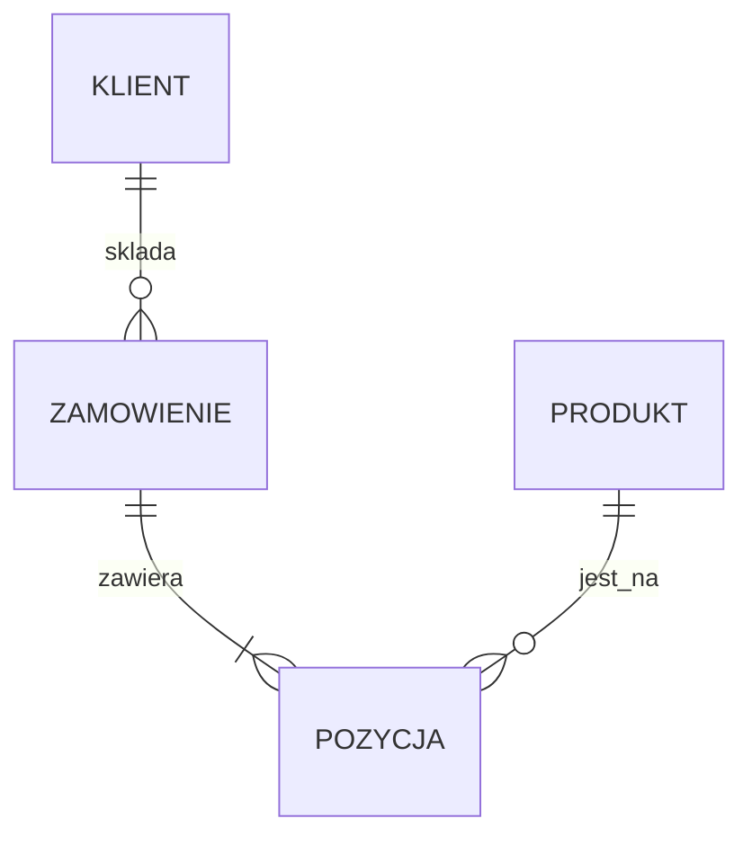

# 3. Z Chena na tabele

> Ten sam model, inny rysunek. Chen zostaje na koncepcji. Tabele i FK: [Crow’s Foot](../projektowanie/crows-foot.md). SQL: [`chen-na-tabele.sql`](../sql/projektowanie/chen-na-tabele.sql).

## Mapowanie (wkuć)

| W Chenie | W SQL Server |
|---|---|
| Encja mocna | Tabela; klucz → `PRIMARY KEY` |
| Encja słaba | `PRIMARY KEY (PK_właściciela, klucz_częściowy)` + FK, zwykle `ON DELETE CASCADE` |
| 1:N | FK po stronie N; `NOT NULL` przy uczestnictwie całkowitym |
| 1:1 | FK `UNIQUE` |
| M:N | Tabela związku, PK para FK (albo para + `Lp`) |
| Atrybuty związku | Kolumny tabeli związku / strony N |
| ◎ wielowartościowy | Osobna tabela |
| ◌ pochodny | Pomijasz albo `AS` — nie ręczna kopia |

Nie rysuj M:N jako dwóch łapek między encjami biznesowymi bez tabeli `Pozycja` / `Zapis`.

## Ten sam fakt: Chen vs łapki vs mermaid

Chen:

```text
  KLIENT  1 ── ◆ SKŁADA ◆ ── N  ZAMÓWIENIE
         (częściowe)        (całkowite)
```

Crow’s Foot: `KLIENT ||——o< ZAMÓWIENIE`.

Logiczna warstwa (nie Chen) — do slajdu / GitHub:



Mermaid `erDiagram` to łapki, nie romby. Na zaliczeniu Chen zostaje obowiązkowy; mermaid wolno **dodać**.

## Ćwiczenie

1. Odpal [`chen-na-tabele.sql`](../sql/projektowanie/chen-na-tabele.sql). Wskaż w DDL: encję słabą, atrybut wielowartościowy, UNIQUE biznesowy.
2. Weź swój Chen z lekcji 2 i wypisz tabele: PK, FK, `NOT NULL` vs NULL.
3. Dla każdego FK zapisz na razie tylko *czy dziecko może żyć bez rodzica* — akcję `ON DELETE` dobierzesz w [lekcji 6](06-integralnosc.md).

Dalej: [klucze, typy, nazwy](04-klucze-typy-nazwy.md).
